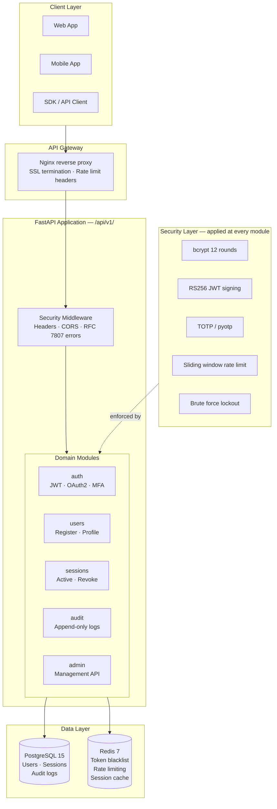
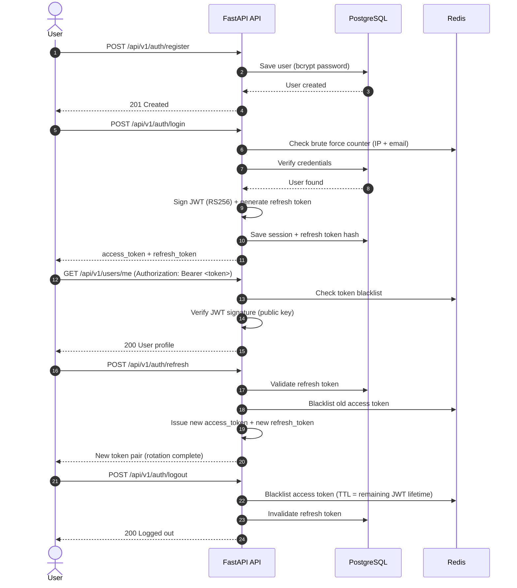

<div align="center">

# 🔐 SecureAuth Platform

**Open-source authentication and authorization as a service.**
Self-hostable alternative to Auth0, Okta, and Keycloak — built for production.

[](https://github.com/Yeisson-PB/secureauth-platform/actions)
[](./coverage.xml)
[](https://www.python.org)
[](https://fastapi.tiangolo.com)
[](./LICENSE)
[](https://owasp.org/www-project-top-ten/)

[**Live Docs →**](http://localhost:8000/docs) · [**Report a Bug**](https://github.com/Yeisson-PB/secureauth-platform/issues) · [**Request a Feature**](https://github.com/Yeisson-PB/secureauth-platform/issues)

</div>

---

## ✨ Features

| Feature | Status | Description |
|---|---|---|
| 📧 Email / Password Auth | ✅ Ready | Secure registration and login with bcrypt (12 rounds) |
| 🔑 JWT RS256 | ✅ Ready | Asymmetric signing — public key verifiable by any service |
| 🔄 Refresh Token Rotation | ✅ Ready | Each use generates a new token and invalidates the previous |
| 🚫 Token Blacklist | ✅ Ready | Redis-backed blacklist with automatic TTL expiry |
| 📱 MFA / TOTP | ✅ Ready | Google Authenticator compatible, with recovery codes |
| 🌐 OAuth2 — Google | ✅ Ready | Social login with Google |
| 🐙 OAuth2 — GitHub | ✅ Ready | Social login with GitHub |
| 🛡️ Rate Limiting | ✅ Ready | Sliding window per IP and per user (Redis) |
| 🔒 Brute Force Protection | ✅ Ready | Progressive lockout: 5 attempts → 15 min block |
| 🖥️ Session Management | ✅ Ready | List and revoke active sessions by device |
| 📋 Audit Logs | ✅ Ready | Immutable append-only logs: who, what, when, from where |
| 👑 Admin API | ✅ Ready | Manage users, sessions, and audit logs via REST |
| 🔐 Security Headers | ✅ Ready | HSTS, CSP, X-Frame-Options, X-Content-Type-Options |
| 📖 OpenAPI / Swagger | ✅ Ready | Always-on at `/docs` with full request/response examples |

---

## 🏗️ Architecture



---

## 🔄 Authentication Flow



---

## 🚀 Quickstart

### Prerequisites

- [Docker](https://docs.docker.com/get-docker/) + [Docker Compose](https://docs.docker.com/compose/)
- [UV](https://docs.astral.sh/uv/getting-started/installation/) (Python package manager)

### 1. Clone and configure

```bash
git clone https://github.com/yourusername/secureauth-platform.git
cd secureauth-platform

# Copy environment template
cp .env.example .env
```

### 2. Generate RS256 keys for JWT signing

```bash
uv run python scripts/generate_keys.py

# Add the generated keys to your .env:
# JWT_PRIVATE_KEY=$(cat keys/private.pem)
# JWT_PUBLIC_KEY=$(cat keys/public.pem)
```

### 3. Start all services

```bash
make up
# or: docker compose up --build -d
```

### 4. Verify everything is running

```bash
# Check service health
docker compose ps

# Test the API
curl http://localhost:8000/health
# → {"status": "ok", "version": "0.1.0"}

# Open interactive API docs
open http://localhost:8000/docs
```

---

## 📁 Project Structure

```
secureauth-platform/
├── app/
│   ├── main.py                  # FastAPI app entry point
│   ├── core/
│   │   ├── config.py            # Pydantic Settings (env vars)
│   │   └── exceptions.py        # RFC 7807 global error handlers
│   ├── api/
│   │   └── v1/
│   │       └── router.py        # Central API v1 router
│   ├── modules/
│   │   ├── auth/                # JWT, OAuth2, MFA, login, logout
│   │   ├── users/               # Registration, profile, password
│   │   ├── sessions/            # Active sessions, revocation
│   │   ├── audit/               # Immutable audit logs
│   │   └── admin/               # Admin management API
│   └── shared/
│       └── schemas.py           # Shared Pydantic schemas
├── tests/
│   ├── conftest.py              # Shared pytest fixtures
│   ├── unit/                    # Unit tests per module
│   ├── integration/             # End-to-end API tests
│   └── security/                # Security-specific tests
├── alembic/                     # Database migrations
├── scripts/
│   └── generate_keys.py         # RS256 key pair generator
├── Dockerfile                   # Multi-stage production image
├── docker-compose.yml           # Development environment
├── docker-compose.test.yml      # Isolated test environment
├── pyproject.toml               # UV / project configuration
└── Makefile                     # Developer shortcuts
```

---

## 🛠️ Developer Commands

```bash
make up              # Start all services (dev)
make down            # Stop all services
make logs            # Follow logs from all containers
make shell           # Open bash in the API container
make test            # Run full test suite (isolated containers)
make lint            # Check Black + Flake8 + isort + Bandit
make format          # Auto-format code
make migrate         # Apply Alembic migrations
make migrate-create name=add_users_table
make keys            # Generate RS256 key pair
make clean           # Remove containers, volumes, images
```

---

## 🔐 Security Design Decisions

| Decision | Choice | Why |
|---|---|---|
| Password hashing | bcrypt (12 rounds) | Industry standard; 12 rounds balances security and performance |
| JWT algorithm | RS256 (asymmetric) | Services can verify tokens with the public key only — no shared secret |
| Token storage | Redis blacklist | Immediate revocation without waiting for JWT expiry |
| Refresh tokens | Rotation on every use | A stolen refresh token is detected and invalidated on next use |
| Rate limiting | Sliding window (Redis) | More accurate than fixed window; prevents boundary attacks |
| MFA | TOTP (RFC 6238) | Compatible with any authenticator app; no vendor lock-in |
| Error format | RFC 7807 | Standard machine-readable error format for API consumers |

---

## 🧪 Running Tests

```bash
# Full test suite in isolated Docker environment
make test

# Local (requires running db and redis)
uv run pytest tests/ -v --cov=app --cov-report=html

# Security tests only
uv run pytest tests/security/ -v

# With coverage report
open htmlcov/index.html
```

---

## 📡 API Overview

All endpoints are under `/api/v1/`. Full interactive documentation available at `/docs`.

| Method | Endpoint | Description |
|---|---|---|
| `POST` | `/auth/register` | Create a new user account |
| `POST` | `/auth/login` | Authenticate and receive token pair |
| `POST` | `/auth/refresh` | Rotate refresh token |
| `POST` | `/auth/logout` | Invalidate tokens and end session |
| `POST` | `/auth/mfa/enable` | Enable TOTP multi-factor authentication |
| `POST` | `/auth/mfa/verify` | Verify TOTP code |
| `GET` | `/auth/oauth/google` | Initiate Google OAuth2 flow |
| `GET` | `/auth/oauth/github` | Initiate GitHub OAuth2 flow |
| `GET` | `/users/me` | Get current user profile |
| `PATCH` | `/users/me` | Update current user profile |
| `GET` | `/sessions` | List active sessions |
| `DELETE` | `/sessions/{id}` | Revoke a specific session |
| `GET` | `/audit/logs` | Query audit log (paginated) |
| `GET` | `/admin/users` | List all users (admin only) |

---

## 🤝 Contributing

1. Fork the repository
2. Create a feature branch: `git checkout -b feat/your-feature`
3. Install dependencies: `uv sync --group dev`
4. Install pre-commit hooks: `uv run pre-commit install`
5. Make your changes and run: `make lint && make test`
6. Commit using conventional commits: `feat(scope): description`
7. Open a Pull Request

---

## 📄 License

MIT — see [LICENSE](./LICENSE) for details.

---

<div align="center">
Built using FastAPI · PostgreSQL · Redis · UV
</div>
