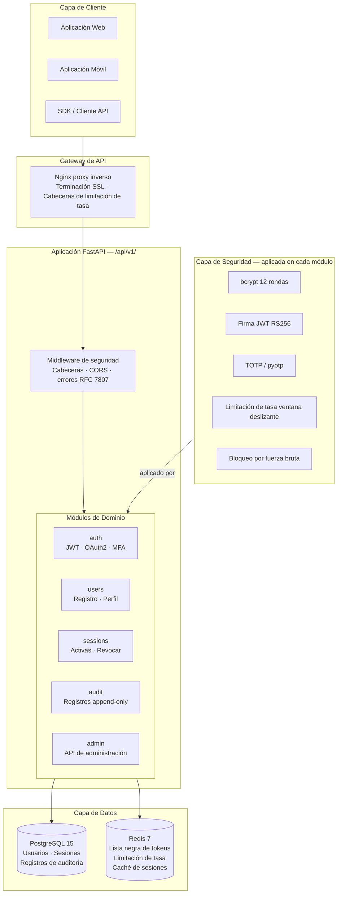
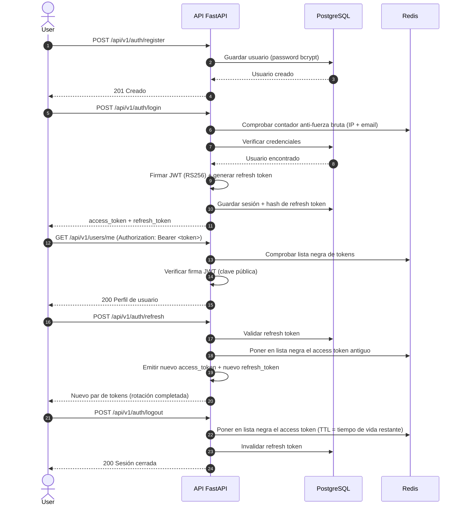

<div align="center">

# 🔐 SecureAuth Platform

**Autenticación y autorización open-source como servicio.**
Alternativa autoalojable a Auth0, Okta y Keycloak — diseñada para producción.

[](https://github.com/Yeisson-PB/secureauth-platform/actions)
[](./coverage.xml)
[](https://www.python.org)
[](https://fastapi.tiangolo.com)
[](./LICENSE)
[](https://owasp.org/www-project-top-ten/)

[**Docs en vivo →**](http://localhost:8000/docs) · [**Reportar un error**](https://github.com/Yeisson-PB/secureauth-platform/issues) · [**Solicitar una función**](https://github.com/Yeisson-PB/secureauth-platform/issues)

</div>

---

## ✨ Funcionalidades

| Funcionalidad | Estado | Descripción |
|---|---|---|
| 📧 Autenticación Email / Contraseña | ✅ Listo | Registro y acceso seguros con bcrypt (12 rondas) |
| 🔑 JWT RS256 | ✅ Listo | Firma asimétrica — clave pública verificable por cualquier servicio |
| 🔄 Rotación de Refresh Token | ✅ Listo | Cada uso genera un nuevo token e invalida el anterior |
| 🚫 Lista negra de tokens | ✅ Listo | Lista negra en Redis con expiración TTL automática |
| 📱 MFA / TOTP | ✅ Listo | Compatible con Google Authenticator, con códigos de recuperación |
| 🌐 OAuth2 — Google | ✅ Listo | Inicio de sesión social con Google |
| 🐙 OAuth2 — GitHub | ✅ Listo | Inicio de sesión social con GitHub |
| 🛡️ Limitación de tasa | ✅ Listo | Ventana deslizante por IP y por usuario (Redis) |
| 🔒 Protección contra fuerza bruta | ✅ Listo | Bloqueo progresivo: 5 intentos → 15 min de bloqueo |
| 🖥️ Gestión de sesiones | ✅ Listo | Listar y revocar sesiones activas por dispositivo |
| 📋 Registros de auditoría | ✅ Listo | Registros inmutables en modo append-only: quién, qué, cuándo, desde dónde |
| 👑 API de administración | ✅ Listo | Gestionar usuarios, sesiones y auditoría vía REST |
| 🔐 Cabeceras de seguridad | ✅ Listo | HSTS, CSP, X-Frame-Options, X-Content-Type-Options |
| 📖 OpenAPI / Swagger | ✅ Listo | Siempre disponible en `/docs` con ejemplos completos de request/response |

---

## 🏗️ Arquitectura



---

## 🔄 Flujo de Autenticación



---

## 🚀 Inicio rápido

### Requisitos previos

- [Docker](https://docs.docker.com/get-docker/) + [Docker Compose](https://docs.docker.com/compose/)
- [UV](https://docs.astral.sh/uv/getting-started/installation/) (gestor de paquetes de Python)

### 1. Clonar y configurar

```bash
git clone https://github.com/yourusername/secureauth-platform.git
cd secureauth-platform

# Copiar plantilla de entorno
cp .env.example .env
```

### 2. Generar claves RS256 para firmar JWT

```bash
uv run python scripts/generate_keys.py

# Agrega las claves generadas a tu .env:
# JWT_PRIVATE_KEY=$(cat keys/private.pem)
# JWT_PUBLIC_KEY=$(cat keys/public.pem)
```

### 3. Iniciar todos los servicios

```bash
make up
# o: docker compose up --build -d
```

### 4. Verificar que todo esté en funcionamiento

```bash
# Verificar el estado de los servicios
docker compose ps

# Probar la API
curl http://localhost:8000/health
# → {"status": "ok", "version": "0.1.0"}

# Abrir documentación interactiva
open http://localhost:8000/docs
```

---

## 📁 Estructura del proyecto

```
secureauth-platform/
├── app/
│   ├── main.py                  # Punto de entrada de la aplicación FastAPI
│   ├── core/
│   │   ├── config.py            # Configuración Pydantic (variables de entorno)
│   │   └── exceptions.py        # Manejadores globales de errores RFC 7807
│   ├── api/
│   │   └── v1/
│   │       └── router.py        # Enrutador central de la API v1
│   ├── modules/
│   │   ├── auth/                # JWT, OAuth2, MFA, login, logout
│   │   ├── users/               # Registro, perfil, contraseña
│   │   ├── sessions/            # Sesiones activas, revocación
│   │   ├── audit/               # Registros de auditoría inmutables
│   │   └── admin/               # API de administración
│   └── shared/
│       └── schemas.py           # Schemas compartidos de Pydantic
├── tests/
│   ├── conftest.py              # Fixtures compartidos de pytest
│   ├── unit/                    # Pruebas unitarias por módulo
│   ├── integration/             # Pruebas end-to-end de la API
│   └── security/                # Pruebas específicas de seguridad
├── alembic/                     # Migraciones de base de datos
├── scripts/
│   └── generate_keys.py         # Generador de par de claves RS256
├── Dockerfile                   # Imagen de producción multietapa
├── docker-compose.yml           # Entorno de desarrollo
├── docker-compose.test.yml      # Entorno de pruebas aislado
├── pyproject.toml               # Configuración de UV / proyecto
└── Makefile                     # Atajos para desarrollo
```

---

## 🛠️ Comandos para desarrolladores

```bash
make up              # Iniciar todos los servicios (dev)
make down            # Detener todos los servicios
make logs            # Seguir los logs de todos los contenedores
make shell           # Abrir bash en el contenedor de la API
make test            # Ejecutar suite completa de pruebas (contenedores aislados)
make lint            # Revisar Black + Flake8 + isort + Bandit
make format          # Formatear el código automáticamente
make migrate         # Aplicar migraciones de Alembic
make migrate-create name=add_users_table
make keys            # Generar par de claves RS256
make clean           # Eliminar contenedores, volúmenes, imágenes
```

---

## 🔐 Decisiones de diseño de seguridad

| Decisión | Elección | Por qué |
|---|---|---|
| Hashing de contraseñas | bcrypt (12 rondas) | Estándar de la industria; 12 rondas equilibran seguridad y rendimiento |
| Algoritmo JWT | RS256 (asimétrico) | Los servicios pueden verificar tokens solo con la clave pública — sin secreto compartido |
| Almacenamiento de tokens | Lista negra en Redis | Revocación inmediata sin esperar expiración del JWT |
| Refresh tokens | Rotación en cada uso | Un refresh token robado se detecta e invalida en el siguiente uso |
| Limitación de tasa | Ventana deslizante (Redis) | Más preciso que ventana fija; previene ataques en los bordes |
| MFA | TOTP (RFC 6238) | Compatible con cualquier app de autenticación; sin dependencia de proveedor |
| Formato de error | RFC 7807 | Formato estándar legible por máquinas para consumidores de API |

---

## 🧪 Ejecución de pruebas

```bash
# Suite completa de pruebas en entorno Docker aislado
make test

# Local (requiere db y redis en ejecución)
uv run pytest tests/ -v --cov=app --cov-report=html

# Solo pruebas de seguridad
uv run pytest tests/security/ -v

# Con informe de cobertura
open htmlcov/index.html
```

---

## 📡 Descripción general de la API

Todos los endpoints están bajo `/api/v1/`. Documentación interactiva completa disponible en `/docs`.

| Método | Endpoint | Descripción |
|---|---|---|
| `POST` | `/auth/register` | Crear una nueva cuenta de usuario |
| `POST` | `/auth/login` | Autenticar y recibir par de tokens |
| `POST` | `/auth/refresh` | Rotar refresh token |
| `POST` | `/auth/logout` | Invalidar tokens y cerrar sesión |
| `POST` | `/auth/mfa/enable` | Activar autenticación multifactor TOTP |
| `POST` | `/auth/mfa/verify` | Verificar código TOTP |
| `GET` | `/auth/oauth/google` | Iniciar flujo OAuth2 de Google |
| `GET` | `/auth/oauth/github` | Iniciar flujo OAuth2 de GitHub |
| `GET` | `/users/me` | Obtener perfil del usuario actual |
| `PATCH` | `/users/me` | Actualizar perfil del usuario actual |
| `GET` | `/sessions` | Listar sesiones activas |
| `DELETE` | `/sessions/{id}` | Revocar una sesión específica |
| `GET` | `/audit/logs` | Consultar registro de auditoría (paginado) |
| `GET` | `/admin/users` | Listar todos los usuarios (solo admin) |

---

## 🤝 Contribuir

1. Haz fork del repositorio
2. Crea una rama de función: `git checkout -b feat/your-feature`
3. Instala dependencias: `uv sync --group dev`
4. Instala hooks de pre-commit: `uv run pre-commit install`
5. Realiza tus cambios y ejecuta: `make lint && make test`
6. Haz commit usando conventional commits: `feat(scope): description`
7. Abre un Pull Request

---

## 📄 Licencia

MIT — ver [LICENSE](./LICENSE) para más detalles.

---

<div align="center">
Construido con FastAPI · PostgreSQL · Redis · UV
</div>
